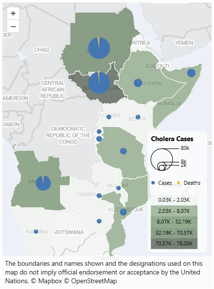
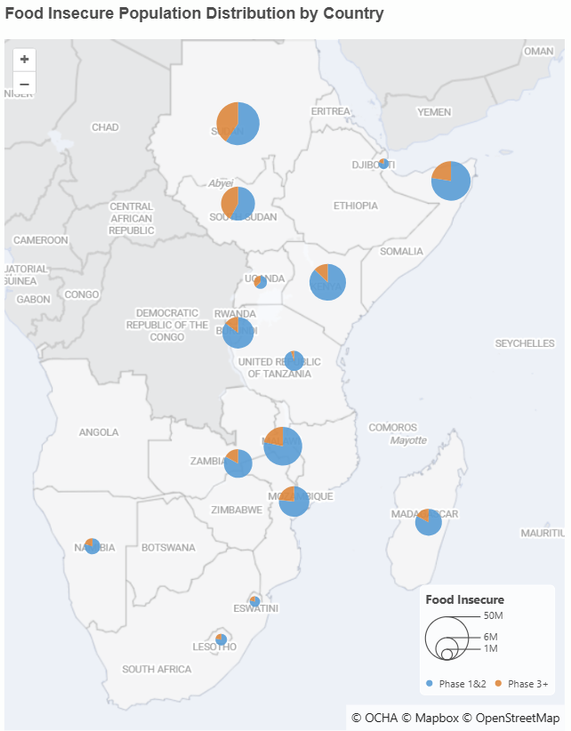

<!-- markdownlint-disable-next-line MD033 -->
# Rosea MapViz Power BI Visual 

[](https://github.com/IM4SEA/rosea-mapviz-pbi/actions/workflows/build.yml) [](https://gist.github.com/ayiemba/2e6451b2d946f0f58920cc89b1b5ef8b)

Rosea MapViz adds two map layers to Power BI—choropleth regions and scaled circles—with legends, tooltips, and modern basemaps. New display types include **H3 Hexbin** for spatial aggregation and **Hotspot** heatmaps for density visualization.

Rendering engines

- SVG (default): great quality for small–medium datasets.
- Canvas: faster CPU rendering; good for large polygons/many points.


## Features

- Choropleth (numeric classification with color ramps)
- Scaled circles (1–2 measures; nested, pie, or donut)
- **H3 Hexbin** aggregation with configurable resolution (0–15) and 10 color ramps
- **Hotspot** heatmap with customizable glow, blur, and dedicated colors
- **Scaling methods**: Linear, Logarithmic, Square Root, Quantile (for data with outliers)
- Works together or separately
- Basemaps: OpenStreetMap, Mapbox, MapTiler (or none)
- Legends, tooltips, cross-filtering, zoom control
- Auto-fit to data; topology-preserving simplification (strength control)
- Configurable circle label offset for fine-tuned positioning

## Screenshots

<p align="center">
  
  
</p>

## Data roles

Assign only what you need for the layers you enable (Power BI Visualizations pane).

- Boundary ID: join key present in BOTH your data and boundary properties (e.g., shapeISO, ADM*_PCODE, shapeID). Max 1.
- Latitude / Longitude: numeric coordinates for circles. Max 1 each.
- Size: measure(s) for circle size. Max 2.
- Color: measure for choropleth. Max 1.
- Tooltips: extra measures to show on hover.
- Mapbox Access Token: single text value for Mapbox basemaps; overrides the format pane token when provided.
- MapTiler API Key: single text value for MapTiler basemaps; overrides the format pane key when provided.

Notes

- Data reduction: up to ~30,000 category rows (subject to Power BI limits).
- If only choropleth is used, Lat/Long/Size aren’t required. If only circles are used, Boundary ID isn’t required.
- Basemap credentials: when a Mapbox or MapTiler data role is bound, the matching format pane input hides automatically.
- Prefer passing credentials through Power BI Parameters (What-if or field parameters) so tokens stay outside the PBIX file when you publish.

### Boundary joining (quick example)

1) In Format → Choropleth → Boundary, choose your source (GeoBoundaries or Custom URL).
2) Pick the matching field:

	 - GeoBoundaries: shapeISO, shapeName, shapeID, or shapeGroup.
	 - Custom: enter your property name (e.g., ADM1_PCODE).

3) Optionally set “TopoJSON Object Name” when your TopoJSON has multiple named objects (e.g., ADM1, boundaries). Leave blank to auto-detect.

Geometry handling

- FeatureCollection, Polygon, and MultiPolygon geometries render directly.
- GeometryCollection is supported; polygonal members are merged into a single polygon/multipolygon per feature while point/line members are ignored for choropleth styling.

Minimal mapping

- Boundary field: shapeISO
- Data column: AdminPCodeNameID (values like KE-01)

GeoBoundaries notes

- “All Countries” uses a consolidated ADM0 TopoJSON for efficient country outlines.
- The visual prefers TopoJSON when available and caches large downloads.

## Quick start

1) Add the visual to your report (import .pbiviz or use Developer Mode).
2) Bind Boundary ID or Latitude/Longitude and your measures.
3) In Format, toggle layers and choose basemap, color ramp, and legend.
4) Optional: switch Rendering Engine (SVG or Canvas).

## Install & develop

- From release: download a .pbiviz from GitHub Releases and import into Power BI Desktop (Insert → More visuals → Import from file).
- From source:

  - Install deps: npm install
  - Dev server: npm start (Power BI Developer Mode)
  - Package: npm run build (outputs dist/*.pbiviz)
  - Tests: npm test (Jest)

## Security & privileges

- HTTPS only for external boundary URLs; open-redirect parameters are blocked.
- Validated P-codes only; non-matching features won't render.
- Default boundary fetch timeout: 25s; requests append ml_source=rosea-mapviz-pbi; CORS required for user-hosted files.

Required privileges (capabilities.json)

- WebAccess to these domains:

	- https://*.openstreetmap.org, https://*.arcgisonline.com, https://*.arcgis.com, https://*.mapbox.com, https://api.maptiler.com, https://*.humdata.org, https://*.itos.uga.edu, https://*.githubusercontent.com, https://*.googleapis.com, https://*.amazonaws.com, https://*.blob.core.windows.net, https://*.github.io, https://*.cloudfront.net, https://*.r2.dev, https://*.geoboundaries.org, https://www.geoboundaries.org, https://cdn.jsdelivr.net

- LocalStorage (cache) and ExportContent are also requested.

API keys (Mapbox/MapTiler)

- Bind the **Mapbox Access Token** or **MapTiler API Key** data role when you need report-level or measure-driven credentials. These override any format pane values.
- Prefer feeding these roles from Power BI Parameters so credentials can be managed centrally and excluded from the PBIX payload.
- Restrict tokens to https://app.powerbi.com and https://app.fabric.microsoft.com; add https://localhost:<port> for development.
- Prefer scoped/read-only tokens; for stronger control, use short-lived tokens/SAS or a proxy that injects credentials.

## Docs & support

- Specs and guides: `spec/` (start with [spec/main.md](spec/main.md))
- Versioning: [docs/versioning.md](docs/versioning.md)
- Issues: https://github.com/IM4SEA/rosea-mapviz-pbi/issues

## Automated Versioning

CI uses `npm run version:auto` to:
- Bump major/minor/patch when `SEMVER_BUMP` is set.
- Otherwise increment only the 4th (build) number.
- Commit build bumps automatically (guarded to avoid loops).

Example workflow step:

```yaml
- name: Auto Version
	env:
		AUTO_COMMIT: 1
		SEMVER_BUMP: ${{ inputs.semver_bump }} # optional: major|minor|patch
	run: npm run version:auto
```

Only semantic (x.y.z) changes trigger a release; build-only increments just produce artifacts.

## License

MIT. See [LICENSE](LICENSE).
