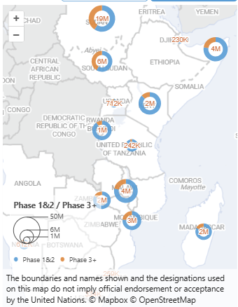
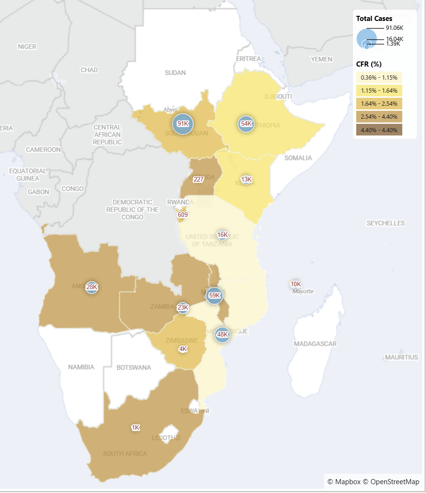

<!-- markdownlint-disable-next-line MD033 -->
# Rosea MapViz Power BI Visual 

 

Rosea MapViz helps you build interactive Power BI maps using **choropleth regions**, **scaled circles**, **H3 hexbin**, and **hotspot** density layers.

## Install (Power BI users)

1. Download the latest `.pbiviz` from [Releases](https://github.com/ocha-rosea/rosea-mapviz-pbi/releases).
2. In Power BI Desktop: **Insert → More visuals → Import from file**.
3. Add Rosea MapViz to your report.

## Quick start

1. Add required data fields (see Data roles below).
2. In **Format**, enable the map type(s) you need.
3. Choose basemap, legend, and style settings.
4. Optional: switch render engine (`SVG` or `Canvas`) for quality/performance.

## Examples

## Data roles (what to bind)

- `Boundary ID`: join key for choropleth (e.g., `shapeISO`, `ADM1_PCODE`, `shapeID`)
- `Latitude` + `Longitude`: coordinates for circles/hexbin/hotspot
- `Size` (up to 2): circle measures
- `Color`: choropleth measure
- `Tooltips`: additional hover measures
- `Mapbox Access Token` / `MapTiler API Key`: optional credential overrides

## Security note

- Use **public** Mapbox tokens (`pk.*`) only.
- Prefer Power BI data roles over visual-formatting key entry for credential input:
  - **Data roles (better):** central model-driven input, easier rotation, and fewer per-visual manual copy/paste points.
  - **Visual formatting key fields:** stored per visual instance, harder to rotate consistently, and more prone to key sprawl.
- Best practice: define credentials in a Power BI parameter and map that parameter into the token data role (`Mapbox Access Token` / `MapTiler API Key`).
- Do not commit real API keys/tokens into reports, templates, docs, or source files.
- Prefer environment- or tenant-managed secrets for distribution workflows.
- Note: neither path is a true secret vault; tokens are still delivered to the client visual for map requests.

## Map types and configuration guides

- Full user guide (all map types): [docs/map-types-and-configuration.md](docs/map-types-and-configuration.md)
- Geometry simplification tips: [docs/simplification.md](docs/simplification.md)

## For developers and contributors

- Developer setup and release workflow: [docs/developer-guide.md](docs/developer-guide.md)
- Versioning strategy: [docs/versioning.md](docs/versioning.md)
- Contribution process: [CONTRIBUTING.md](CONTRIBUTING.md)

## Support

- Report issues: [GitHub Issues](https://github.com/ocha-rosea/rosea-mapviz-pbi/issues)
- Technical specification: [spec/main.md](spec/main.md)

## License

MIT. See [LICENSE](LICENSE).
