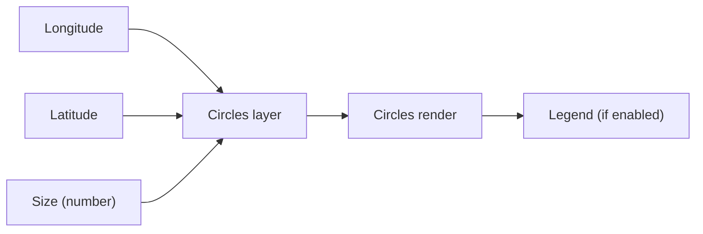
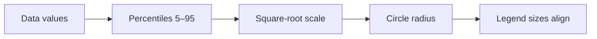

# Scaled Circles — Quick Reference (Concise)

Short guide to get scaled circles running fast. See the full spec for details: ./scaled-circles-specification.md

## What you bind



Required
- Longitude and Latitude - decimal degrees
- Size - numeric measure
- Optional - Size Secondary for nested or donut, Tooltips

## Configure in 4 steps
1) Chart type — nested-circles | donut-chart | pie-chart | **hotspot** | **h3-hexbin**
2) Appearance — min/max radius, colors, stroke, opacities
3) Legend — show, title, spacing, item stroke
4) Rendering engine — SVG (default) or Canvas

Minimal settings
```
Type: nested-circle
Min radius: 3  Max radius: 30
Color1: #f58220  Color2: #ffc800
Opacity: 80 percent
Legend: on  Title: Circles
```

---

## New Display Types

### H3 Hexbin
Aggregates point data into H3 hexagonal bins for spatial analysis.

- **Resolution**: 0 (global) to 15 (sub-meter), default 4
- **Color ramps**: viridis, plasma, inferno, magma, cividis, turbo, spectral, coolwarm, blues, oranges
- **Scaling methods**: Linear, Logarithmic, Square Root, Quantile (for outlier handling)
- **Custom styling**: Fill/stroke colors, min/max opacity

### Hotspot
Heat-style density visualization with glow effects.

- **Hotspot color**: Base color for heat visualization
- **Glow color**: Outer glow effect color
- **Blur amount**: Controls spread/softness (default 5)
- **Radius**: Base hotspot size (default 8)
- **Scaling methods**: Linear, Logarithmic, Square Root, Quantile
- **Scale by value**: Toggle to size hotspots by data value

---

## Circle Labels

Labels can be positioned at center, above, below, left, or right of circles.

- **Label Offset**: Distance in pixels between circle edge and label (0–20, default 2)
- **Background**: Optional background box with padding, border radius, and opacity
- **Halo**: Text stroke for readability on complex backgrounds

---

## Scaling and legend - essentials

- Areas scale with data - square-root radii for perception
- Uses 5th to 95th percentile range for robust sizing
- Outliers above 95th are compressed but remain larger
- Legend circles match map sizes exactly - 100 percent - 50 percent - 25 percent diameter



---

## Quick fixes
- Too small or large - adjust min and max radius
- Overlap heavy - lower opacity or use nested circles
- Flat sizes - narrow data range - verify measure
- One huge circle - expected - outlier compression applies
- View not fitting - ensure "Lock map extent" is off; zoom-to-layer works for all engines

---

## Best practices - short
1) Min radius 3 to 5 px - Max 20 to 30 px
2) Use contrasting colors - inner and outer clearly distinct
3) Keep legend away from dense data
4) Keep Size numeric and non-negative

---

## Setup checklist

 - [ ] Longitude and Latitude bound
 - [ ] Size - and optional Secondary - set
 - [ ] Chart type and radii tuned
 - [ ] Legend enabled and titled

---

*For detailed technical information, see the Scaled Circles Specification and API notes.*
